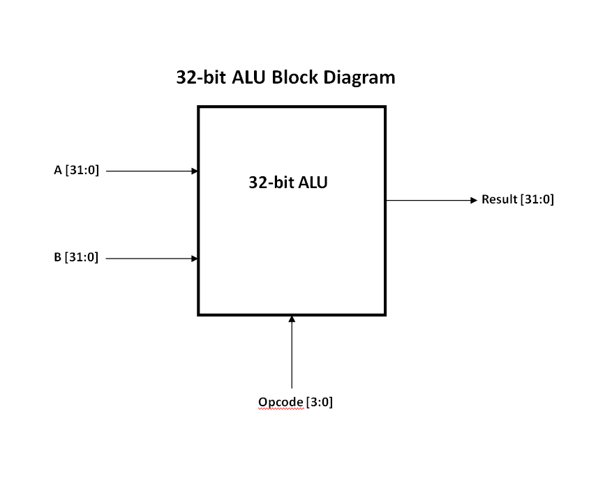
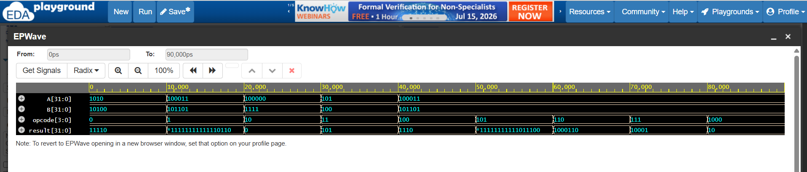
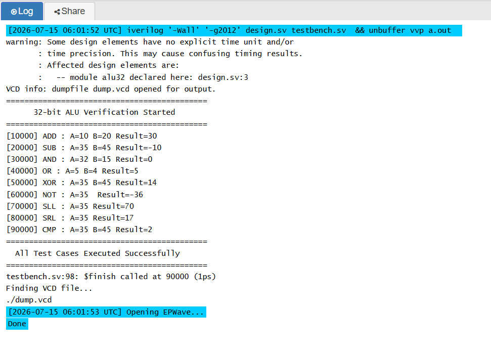

# 32-bit ALU Design and Verification using Verilog HDL
Designed and verified a 32-bit Arithmetic Logic Unit (ALU) in Verilog HDL featuring 9 operations, functional simulation, EPWave waveform analysis, and a modular RTL design.

## Overview
This project implements a **32-bit Arithmetic Logic Unit (ALU)** using **Verilog HDL**. The ALU performs arithmetic operations (addition and subtraction), logical operations (AND, OR, XOR, and NOT), shift operations (logical left shift and logical right shift), and a comparison operation based on a 4-bit opcode.

The design was functionally verified using a dedicated Verilog testbench with multiple test cases and simulated on **EDA Playground** using **EPWave** for waveform analysis.

This project was developed as part of my learning journey in **RTL Design** and **Digital VLSI Design**.

---

## Features
- 32-bit ALU implementation in Verilog HDL
- Modular RTL design
- 4-bit opcode-based on operation selection 
- Functional verification using a Verilog testbench
- EPWave waveform generation 
- Beginner-friendly and well-commented code

---

## Supported Operations
| Opcode |     Operation      |
|--------|--------------------|
|  0000  |     Addition       |
|  0001  |    Subtraction     |
|  0010  |    Bitwise AND     |
|  0011  |    Bitwise OR      |
|  0100  |    Bitwise XOR     |
|  0101  |    Bitwise NOT     |
|  0110  | Logical Left Shift |
|  0111  | Logical Right Shift|
|  1000  |     Comparison     |

---

## Project Structure 
```text
32-bit-ALU-Verilog/
├── rtl/
│   └── design.sv
├── tb/
│   └── testbench.sv
├── images/
│   ├── waveform.png
│   ├── block_diagram.png
│   └── simulation_output.png
├── docs/
│   └── ALU_Report.pdf
├── README.md
└── LICENSE
```

---

## Block Diagram

The block diagram of the 32-bit ALU is shown below.



---

## Functional Verification 

The ALU was functionally verified using a dedicated Verilog testbench. Each supported operation was tested with representative input values, and the outputs were verified using the EPWave waveform viewer.

The following operations were tested

- Addition
- Subtraction
- Bitwise AND
- Bitwise OR
- Bitwise XOR
- Bitwise NOT
- Left Shift
- Right Shift
- Comparison

The simulation output was verified using **EPWave** waveform viewer.

---

## Waveform

The waveform of the 32-bit ALU is shown below.



---

## Sample Simulation Output

```
==================================================
         32-bit ALU Verification Started
==================================================
[10] ADD : A = 10 B = 20 Result =  30
[20] SUB : A = 35 B = 45 Result = -10
[30] AND : A = 32 B = 15 Result =  0
[40] OR  : A = 5  B = 4  Result =  5
[50] XOR : A = 35 B = 45 Result =  14
[60] NOT : A = 35  Result = -36
[70] SLL : A = 35  Result =  70
[80] SRL : A = 35  Result =  17
[90] CMP : A = 35 B = 45 Result =  2
==================================================
      All Test Cases Executed Successfully
==================================================
```
The Simulation Output of the 32-bit ALU is shown below.



---

## Tools Used
- Verilog HDL
- EDA Playground
- EPWave

---

## Learning Outcomes
Through this project, I gained experience in:

- RTL Design using Verilog HDL
- Combinational circuit implementation
- Case statement-based ALU Design
- Testbench development
- Functional verification
- Waveform analysis
- Basic debugging of Verilog designs

---

## Future Improvements

- Add multiplication and division operations
- Add overflow and carry flag generation
- Parameterize the ALU width
- Develop a self-checking testbench
- Perform RTL synthesis using Vivado or Cadence Genus

---

## Author

**Harsh Vardhan Choubey**

B.Tech in Electronics and Communication Engineering

Indian Institute of Information Technology (IIIT) Bhopal

---

## License
This project is released under the MIT License


